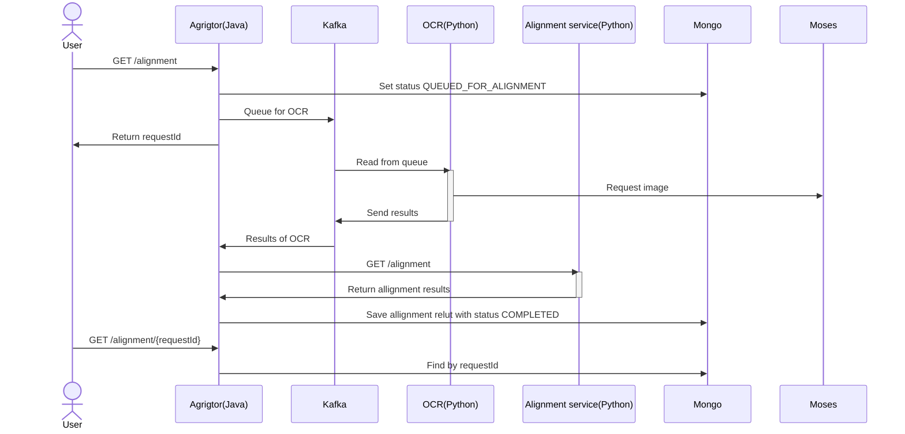

# turbine-prometheus
It is an implementation of Turbine DataHandler that expose turbine metrics in the prometheus format

```mermaid
sequenceDiagram
    actor U as User 
    participant A as Agrigtor(Java) 
    participant K as Kafka
    participant OCR as OCR(Python)
    participant AL as Alignment service(Python)
    participant M as Mongo
    participant Moses as Moses
    U->>A: GET /alignment
    A->>M: Set status QUEUED_FOR_ALIGNMENT
    A->>K:Queue for OCR
    A->>U: Return requestId
    K->>OCR: Read from queue
    activate OCR
    OCR->>Moses: Request image
    OCR->>K: Send results
    deactivate OCR
    K->>A: Results of OCR
    A->>AL: GET /alignment
    activate AL
    AL->>A: Return allignment results
    deactivate AL
    A->>M: Save allignment relut with status COMPLETED
    U->>A: GET /alignment/{requestId}
    A->>M: Find by requestId
```
